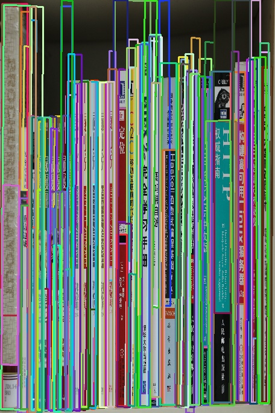
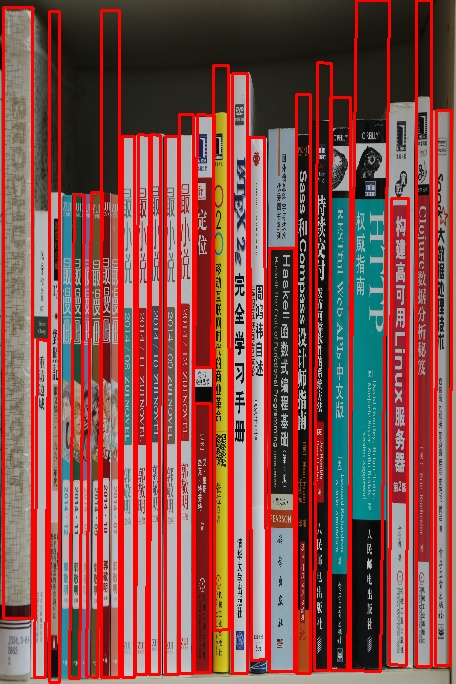

#Book Spine Segment By Python

----
##Overview   
**Book Spine Segment Method** was implemented by Python language with the help of three party  libs, eg. [OpenCV](https://github.com/Itseez/opencv), Numpy, Networkx, etc.

----
##Structure
* main.py
 >
 main.py is the main entry of this implementation, which is consist of the flowing four py files. Especially, it is also contain the extraction of **gradient, angle** for input image, **Graph** processing for each possible candiate rectangle **CRs**, and write the results of **Book Spine Segment** to the fixed directory**(For example "./Example/Dst")*> ``

* SelectImg.py
> SelectImg.py is used to obtain one stablization picture from camera (webcamera).

* LsdLine.py
> In this python file, lines detected by the Line Segment Detector** [LSD](http://docs.opencv.org/3.0-beta/modules/imgproc/doc/feature_detection.html#linesegmentdetector)** algorithm are filtered by their length and changes between horizontal and vertical.

    > **Note that:** For using of **LSD** algorithm, you need install opencv3.0 or later version. Besides, **[opencv_contrib](https://github.com/Itseez/opencv_contrib)** also should be installed.

* Seeds.py
> Seeds.py is in charge of spreading seeds around filtered lines and storing the corresponding directions of seeds.

* Point4.py
> Point4.py is used to obtain the CR's four points by considering the energy changing on edges around the seeds in image.

* FilterCR.py
> Due to the book spine usually does have different ratio of width ang height. FilterCR.py filtering the **CRs** whose ratio is smaller than a predefined threshold. 

* MWIS.py
> MWIS.py is a python version of "Maximum weighted independent set" algorithm. It's used to obtain the final index of CRs for a bookspine picture.

----
##Usage
    if cameraOpen is set True:
        InputImg = SelectImg.SelectImgFromCamera()
    else:
        input : argv[1] or image path
        output: book spine segment images which store in './Example/Dst'
        Usage :
        $ python <name>.py --image=<imagepath>
        eg:
        $ python main.py --image='./Example/Src/002.jpg'

##Result
* **tmp result**.

* **final result**.

----
##License

All code in this project is provided as open source under the BSD license (2-clause "Simplified BSD License"). See LICENSE.txt. 

